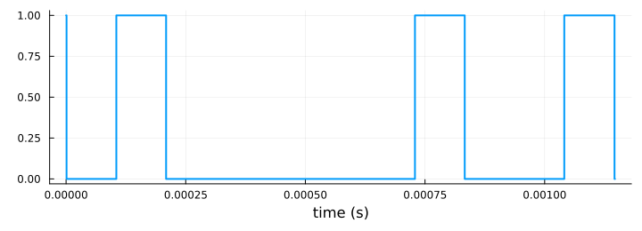

[](https://org-arl.github.io/QuartzHDL.jl) [](https://github.com/org-arl/QuartzHDL.jl/actions) [](https://github.com/JuliaTesting/Aqua.jl) [](https://codecov.io/gh/org-arl/QuartzHDL.jl) [](CONTRIBUTING.md)

# QuartzHDL.jl

**Write FPGA logic in Julia, run it in Julia, compile it to Verilog.**

## Why another HDL?

Algorithmic logic in an FPGA often is a port from an implementation in Julia or Python or MATLAB, rewritten as hardware. Porting and testing can be tricky, and debugging the Verilog implementation can be painful. Wouldn't it be nice if we could just write the hardware description in Julia, pass it inputs and compare the outputs directly from Julia, and poke at various wires in the hardware descriptions from a Julia REPL?

That's what QuartzHDL allows you to do!

QuartzHDL keeps the design in the language the reference is written in. A module is a `struct` whose fields are the registers, with a block that says how those registers behave at every clock edge. The same source runs as ordinary Julia — one function call per clock, values you can inspect and test — and compiles to Verilog. A co-simulation drives both versions with the same stimulus and checks that they agree, cycle for cycle, so that the compiled Verilog is tested to be a faithful port of the Julia version.

QuartzHDL is not a Julia-to-hardware compiler and not a replacement for Verilog. It is Verilog's subset of synchronous logic, written in a language with types, a REPL, a test framework and a plotting library, so that a design can be debugged like software, ported from a reference one step at a time, tested against models of the chips around it, and checked on every push. It also provides higher level design patterns (like finite state machines, metaguards, pipelined computations, multicycle logic, etc) that form a foundation for many designs, but are painful to manually implement in Verilog.

## Features at a glance

- **Hardware description** as a Julia `struct`, with fields as interface wires and registers, and `@on` blocks as behavior.
- **Primitive data types** – `Bool`, `Bits{N}` and `SBits{N}`; any port may be declared active low and is read as asserted.
- **Board level I/O** – `Pad{N}` with tri-state drive and release, on-chip and board pull-ups / pull-downs, and pin bindings with I/O standard and drive strength.
- **Hierarchical designs** – constructed by wiring up submodules, clock domains, gated clock outputs, and vendor black boxes.
- **Hardware idioms** as foundational building blocks – metaguards, self-clearing pulses, countdown timers, edge detectors, finite state machines, multi-step sequences, pipelines, and multicycle paths with their timing constraints.
- **Runs as plain Julia** — one function call per clock edge, tested with `@test` and debugged at the REPL.
- **Simulation** with peripheral logic — real clock rates, models of a USB FIFO, UART, SPI, I2C, PWM and RAM, stand-ins for black boxes, live waveforms in Surfer or `Plots`, and a `sim>` custom REPL.
- **Compiles to Verilog** – co-simulated using Icarus Verilog to ensure that Julia and Verilog outputs match cycle for cycle.
- **Board to bitstream** — `@board` describes the pins, and the constraint file and a Lattice Diamond workspace, with a Makefile that builds the bitstream, are generated from it.

## Installation

```julia
using Pkg
Pkg.add("QuartzHDL")           # Julia 1.11 or later
Pkg.Apps.add("QuartzHDL")      # the `quartz` command; Julia 1.12 or later
```

Co-simulation needs [Icarus Verilog](https://steveicarus.github.io/iverilog/) on the path; live waveforms need [Surfer](https://surfer-project.org).

## An example

A UART transmitter: a byte in, a serial frame out with a parity bit. The frame is a sequence of steps, each one clock; the bit timing is a countdown register and the start strobe is an edge detector, each doing its own bookkeeping.

```julia
using QuartzHDL

const BIT_TIME = 5                   # clocks per bit, less one: 200 kbaud from 1 MHz

@quartz struct UartTx
  # interface wires
  @in  data::Bits{8}                 # 8-bit data to transmit
  @in  send::Bool                    # on rising edge of send
  @in  rst::Bool active=:low         # reset signal, asserted low
  @out tx::Bool = true               # TX pin of the UART
  @out busy::Bool active=:low        # busy signal, asserted low
  # internal state
  step::Step                         # state machine step
  send_e::Edge                       # edge detector for send input
  shift::Bits{8}                     # 8-bit transmit shift register
  parity::Bool                       # parity bit
  baud_timer::Timeout{7}             # 7-bit timer to control baud rate
end

@on UartTx posedge(clk) begin
  @reset(rst)                        # reset module when rst is asserted
  send_e ← send
  @sequence Frame step begin
    @when rose(send_e)               # wait for a send strobe, then
    shift ← data
    parity ← isodd(popcount(data))   # a Julia function, computed in hardware
    tx ← false                       # start bit
    baud_timer ← BIT_TIME
    @repeat 8 begin
      @when expired(baud_timer)      # one bit time later
      tx ← shift[0]                  # a data bit, LSB first
      shift ← shift >> 1
      baud_timer ← BIT_TIME
    end
    @then @when expired(baud_timer)
    tx ← parity                      # transmit parity bit
    baud_timer ← BIT_TIME
    @then @when expired(baud_timer)
    tx ← true                        # stop bit
    baud_timer ← BIT_TIME
    @then @when expired(baud_timer)  # hold it, then back to waiting for send
  end
  busy ← step != Frame.START
end
```

It is ordinary Julia, so it runs as such. A simulation clocks it at a real rate, records the pins you ask for, and hands back signals you can index by time, test, and plot:

```julia
using QuartzHDL.Units, Plots

sim = Simulation(UartTx(); clocks=(clk=1MHz,), watch="*")
out = @run sim begin
  sim.data = Bits{8}('A')
  advance_by(5µs)                   # a few clocks in, strobe send
  sim.send = true
  advance_by(5µs)
  sim.send = false
  advance_by(70µs)
end
plot(out, "clk", "send", "tx", "busy")
```



The same file compiles to Verilog from the command line — a `case` over the sequence's steps, the state machine you would have written by hand:

```
$ quartz uart.jl --top UartTx -o uart.v
```

## Documentation

The [manual](https://org-arl.github.io/QuartzHDL.jl) starts with a [worked example](https://org-arl.github.io/QuartzHDL.jl/quickstart.html) and builds the language up a construct at a time, with notes for readers who know Verilog, and ends with a reference of every public name.
